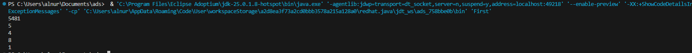
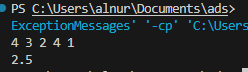
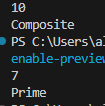
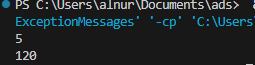
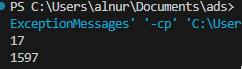
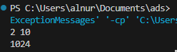
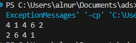
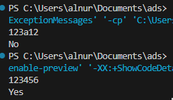
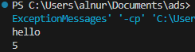
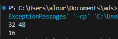

# First Assignment

All tasks are solved using recursion.

## Task 1 - Print digits of a number
Used recursion: first go deep by dividing by 10, then print the last digit on the way back. This way digits are printed in the correct order.

## Task 2 - Average of array elements
Used recursion to sum array elements from the last to the first. Then divided the total sum by n to get the average.

## Task 3 - Prime number check
Recursively checked divisibility starting from n-1 down to 2. If n is divisible by any number, return "Composite". If we reach 1, return "Prime".

## Task 4 - Factorial
Classic recursive factorial: n * fact(n-1), base case is n == 1.

## Task 5 - Fibonacci number
Classic recursive Fibonacci: fib(n-1) + fib(n-2), base cases are fib(0) = 0 and fib(1) = 1.

## Task 6 - Power of a number
Used recursion: multiply n by itself count times. Base case is count == 0, which returns 1.

## Task 7 - Reverse array
Used recursion: printed the element at index n-1 first, then called rec with n-1. This prints the array in reverse order.

## Task 8 - Check if string consists of digits only
Recursively checked each character with Character.isDigit(). If any character is not a digit, return "No". If we reach the end, return "Yes".

## Task 9 - String length
Used recursion: removed the first character each call and added 1. Base case is empty string, which returns 0.

## Task 10 - Greatest Common Divisor
Used the Euclidean algorithm recursively: gcd(b, a % b), base case is b == 0.

